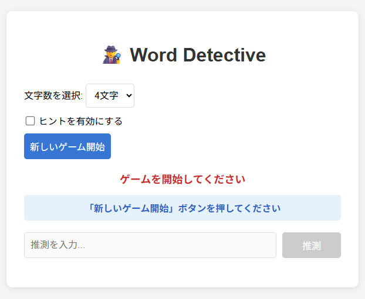

# 🕵️ Word Detective

これは、Go言語で実装されたWebベースの単語当てゲーム「Word Detective」です。古典的な数字当てゲーム「Hit and Blow」（ヌメロンとしても知られています）の単語バージョンです。バックエンドはGoで、フロントエンドはバニラHTML/CSS/JavaScriptで構築されています。

アプリケーションの公開リンク： https://word-detective.onrender.com

## 概要

ランダムに生成された英単語を当てるシンプルなゲームです。プレイヤーは文字数を選択し、制限時間内に正解の単語を推測します。推測するたびに、位置と文字が合っている「Hit」の数と、文字は合っているが位置が違う「Blow」の数がフィードバックとして与えられます。



## ✨ 主な特徴

* **動的な単語生成**: ゲーム開始時に外部API (`random-word-api`) を利用して、毎回異なる単語を正解として設定します。
* **リアルタイムな制限時間**: 30秒の制限時間があり、画面上でリアルタイムにカウントダウンされます。
* **インテリジェントなヒント機能**:
  * プレイヤーはゲーム開始時にヒント機能の有無を選択できます。
  * ヒントを有効にすると、推測状況（Hit/Blow）や時間経過に応じて、正解の文字が少しずつ明かされていきます。
  * 最後の一文字は絶対に明かされないため、ゲームの挑戦性を維持します。
* **インタラクティブなUI**: JavaScriptを使って、サーバーと非同期に通信し、ページをリロードすることなくゲームが進行します。
* **自己完結型**: 追加のデータベースやライブラリを必要とせず、Goの標準ライブラリのみで動作します。

## 遊び方

1. サーバーを起動し、ブラウザで `http://localhost:8080` にアクセスします。
2. 推測したい単語の**文字数**（3〜8文字）を選択します。
3. **ヒント機能**を有効にするかどうかをチェックボックスで選択します。
4. 「新しいゲーム開始」ボタンを押してゲームをスタートします。
5. 30秒の制限時間内に、推測した単語を入力し、「推測」ボタンを押します。
6. 結果として表示される「Hit」と「Blow」の数を元に、正解の単語を推理します。
7. 時間切れになる前、またはすべての文字をHitさせることでゲームが終了します。

## 🛠️ 技術スタック

* **バックエンド**: Go (net/http, encoding/json, etc.)
* **フロントエンド**: HTML, CSS, JavaScript (バニラ)
* **外部API**: [Random Word API](https://random-word-api.herokuapp.com/) (正解の単語生成用)

## 🚀 セットアップと実行方法

1. **Goのインストール**:
   お使いの環境にGo言語がインストールされていることを確認してください。

2. **リポジトリのクローン**:
   ```bash
   git clone https://github.com/NyoRyorN/ase2025_team4.git
   cd ase2025_team4
   ```

3. **サーバーの実行**:
   ターミナルで以下のコマンドを実行します。
   ```bash
   go run wordle_ase.go
   ```

4. **ブラウザでアクセス**:
   ターミナルに「サーバーを開始します...」というメッセージが表示されたら、ブラウザで `http://localhost:8080` を開きます。

## 📡 APIエンドポイント

このアプリケーションは、フロントエンドとの通信のために単一のAPIエンドポイント `/api` を提供します。

* **エンドポイント**: `POST /api`
* **リクエストボディ (JSON)**:
  ```json
  {
    "action": "start" | "guess" | "status",
    "stringLength": 4,         // "start"アクションで使用
    "hintsEnabled": true,      // "start"アクションで使用
    "guess": "word"          // "guess"アクションで使用
  }
  ```
* **レスポンスボディ (JSON)**:
  ゲームの現在の状態、メッセージ、残り時間などを含むJSONオブジェクトが返されます。
